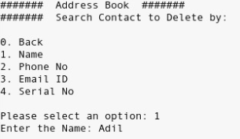

# Adress Book Program Written in C Group Project CS 2600 Spring 2022 California State Polytechnic University, Pomona  

## Table of Contents  

* [Introduction](#Introduction)
* [The Team](#Team)
* [The Project](#Games)
* [Project Documentation](#Docs)
* [Skeleton Code](#Skel)
* [Sample Code](#Sample)
* [Acknowledgments](#Ack)
  

## Introduction   

Address Book is an application written in C language. It keeps track of names and telephone/mobile numbers and e-mail addresses. It is a console based application which uses standard I/O for adding and deleting contact names, phone numbers and e-mail addresses, searching names and associated numbers and email addresses, updating numbers and email addresses, and deleting contacts.

This project will make you implement some important features of C programming which includes command line arguments, input parsing, file operations etc. Since this project is part of the C programming module, it will not use any Abstract Data Type (ADTs) like linked lists, rather you will be using existing C programming features mentioned above. As an advanced level this project can be implemented with ADTs and much more sophisticated search algorithms by achieving much optimal resource usage. 

By implementing this project in a hands-on way you will be able to build a firm understanding on the code C programming concepts and how to apply them on a use case like address book.

 

## The Team   
Known in class as "Group 3"
* Jason Jones - [Portfolio](https://jasonjonesthe.dev/) - [Github](https://github.com/jasojone)
*  Abigail R. Pinkus -   
*  Loosineh Hartoonian -  
*  Jonathon Pfeifroth -  
* Shane A. Green - 

  

## The Project   
Here is the list of requirements that your address book should be in a position to handle. 

* Add Contact
Add a contact giving username
Add phone numbers to the newly added contact
Add e-mail addresses to the newly added contact
* Search Contact
Search a contact by name.
Search contact by phone number.
Search contact by e-mail address.
* Edit Contact
Edit by name.
Edit contact by phone number.
Edit contact by email address.
* Delete contact
Edit by name.
Edit contact by phone number.
Edit contact by email address.
* List all contacts
  Save the address book.
  Exit the application. 

   
## Skeleton Code   

The skeleton code in a very interesting concept used in Emertxe. By looking into the skeleton code, you will get a clear picture into converting the given requirement into a working solution. This will also take care of important aspects like modularity, clean coding practices, re-usability etc.  
[Click here to download the source code for the address book project](https://www.emertxe.com/content/c-programming/code/addressbook_src.zip)

## Sample Output   

 
  

## Project Documentation   
[Prototype Presentation]()  
[Iteration One Deliverables]()  
[Iteration Two Deliverables]()  
[Iteration Three Deliverables]()  
[Iteration Four Deliverables]() 

## Acknowledgements   
1.  **[Wikipedia – Address Book](https://en.wikipedia.org/wiki/Address_book)**
2.  **[Ima](https://en.wikipedia.org/wiki/BMP)[File Operations in C and some reference programs](https://github.com/ptdecker/cbasics)**
3.  **[Download project document in PDF format](https://www.emertxe.com/content/c-programming/address_book.pdf)**
4. **[EMERTXE Advanced Project | Adress Book](https://www.emertxe.com/embedded-systems/c-programming/c-projects/address-book-c/)**
